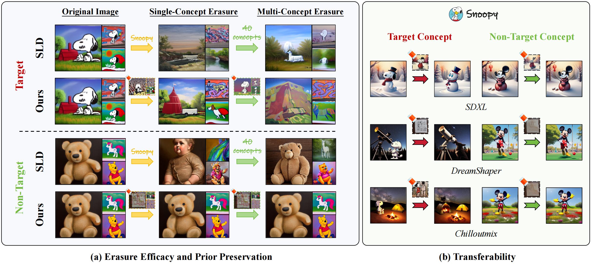
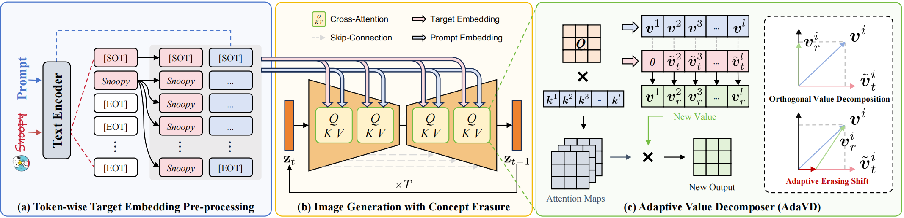

# **Precise, Fast, and Low-cost Concept Erasure in Value Space: Orthogonal Complement Matters**

> **Precise, Fast, and Low-cost Concept Erasure in Value Space: Orthogonal Complement Matters**
> 
> 
> Yuan Wang, Ouxiang Li, Tingting Mu, Yanbin Hao, Kuien Liu, Xiang Wang, Xiangnan He
> 
> **Abstract**: The success of text-to-image generation enabled by diffusion models has imposed an urgent need to erase unwanted concepts, e.g., copyrighted, offensive, and unsafe ones, from the pre-trained models in a precise, timely, and low-cost manner. The twofold demand of concept erasure requires a precise removal of the target concept during generation (i.e., erasure efficacy), while a minimal impact on non-target content generation (i.e., prior preservation). Existing methods are either computationally costly or face challenges in maintaining an effective balance between erasure efficacy and prior preservation. To improve, we propose a precise, fast, and low-cost concept erasure method, called Adaptive Value Decomposer (AdaVD), which is training-free. This method is grounded in a classical linear algebraic orthogonal complement operation, implemented in the value space of each cross-attention layer within the UNet of diffusion models. An effective shift factor is designed to adaptively navigate the erasure strength, enhancing prior preservation without sacrificing erasure efficacy. Extensive experimental results show that the proposed AdaVD is effective at both single and multiple concept erasure, showing a 2- to 10-fold improvement in prior preservation as compared to the second-best, meanwhile achieving the best or near best erasure efficacy, when comparing with both training-based and training-free state of the arts. AdaVD supports a series of diffusion models and downstream image generation tasks, the code is available on the project page: [https://github.com/WYuan1001/AdaVD](https://github.com/WYuan1001/AdaVD)
> 



Our proposed Adaptive Value Decomposer (AdaVD) balances between erasure efficacy and prior preservation and demonstrates transferability across text-to-image (T2I) diffusion models. (a) Compared to SLD, AdaVD enables precise concept erasure without compromising prior knowledge for non-target concepts at both single- and multi-concept erasure. This is facilitated by our precise disentanglement of target semantics (e.g., “Snoopy”) and robust preservation of non-target ones (e.g., “Teddy”), as interpreted in our visualizations marked by . (b) AdaVD can be easily transferred to various T2I models, including SDXL, DreamShaper, and Chilloutmix.



**Overview of our Adaptive Value Decomposer (AdaVD)** in erasing the target concept “*Snoopy*” (a) First, we token-wisely duplicate the last subject token of the target embedding encoded by the text encoder, except for[SOT]. (b) Then, the pre-processed target embedding and corresponding prompt embedding are jointly fed into CA layers within the UNet as conditions, to disentangle target semantics from the original image at each timestep. (c) In each CA layer, we perform token-wise orthogonal value decomposition with an adaptive token-wise shift. The new value is subsequently multiplied by the attention map, producing the erased output for this CA layer.

## Getting Started

### **01. Setup for experiments**

```bash
conda env create -f environment.yml
```

### 02. Image Generation with AdaVD

- **Generate with the Provided code**
    
    To evaluate our **AdaVD using the provided benchmark** and obtain quantitative performance metrics for concept erasure, please run the following commands:
    
    ```bash
    CUDA_VISIBLE_DEVICES=${gpu_id} python src/main.py \
        --erase_type ${erased_concept_type} \
        --target_concept ${erased_concept_1, erased_concept_2, ..., erased_concept_m} \
        --contents ${evaluate_concept_1, evaluate_concept_2, ..., evaluate_concept_n} \
        --mode ${sample_mode} \
        --num_samples ${img_per_prompt} --batch_size ${sample_bs} \
        --save_root ${your_save_path} \
    ```
    
    In the commands above, you can configure the `sample_mode` parameter to determine the sampling mode:
    
    - **`original`**: Generates images using the original Stable Diffusion model.
    - **`retain`**: Produces images after target concept erasure.
    - **`erase`**: Visualizes the erased components.
    
    Additionally, you can set the `erase_type` parameter to evaluate AdaVD's performance in erasing different types of concepts:
    
    - **`instance`**: On Instance Erasure.
    - **`style`**: On Art Style Erasure.
    - **`celebrity`**: On Celebrity Erasure.
    
    You can also adjust the hyper-parameters `--sigmoid_a`, `--sigmoid_b`, and `--sigmoid_c` to erase implicit  concept.
    
    If you want to evaluate AdaVD with **your own benchmark** or **apply it to eliminate numerous concepts or NSFW concepts**, please run the following commands:
    
    **Multi-Concept Erasure with Your Own Benchmark:**
    
    ```bash
    CUDA_VISIBLE_DEVICES=${gpu_id} python src/main_multi.py \
        --erase_type ${your_benchmark_name} \
        --target_concept ${erased_concept_1, erased_concept_2, ..., erased_concept_m} \
        --contents 'erase, retention' \
        --mode ${sample_mode} \
        --num_samples ${img_per_prompt} --batch_size ${sample_bs} \
        --save_root ${your_save_path}
    ```
    
    **NSFW Erasure:**
    
    ```bash
    CUDA_VISIBLE_DEVICES=${gpu_id} python src/main_multi.py \
        --erase_type 'nsfw' \
        --target_concept ${erased_concept_1, erased_concept_2, ..., erased_concept_m} \
        --contents 'nudity' \
        --mode ${sample_mode} \
        --num_samples ${img_per_prompt} --batch_size ${sample_bs} \
        --save_root ${your_save_path}
    ```
    
- **Generate in the notebook demo**
    
    You can also use the [`demo.ipynb`](https://github.com/Con6924/SPM/blob/main/demo.ipynb) notebook to quickly generate examples and compare the original generated image, the visualized erased component, and the image after concept erasure. This provides a clear understanding of the erasure efficacy and prior preservation performance of our AdaVD.